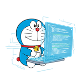

<h1 align="center">Sup , I'm Van Dat Nguyen</h1>
<h3 align="center">A curious mind driven by the dream of building intelligent robots. Learning, creating, and sharing along the way.</h3>

  

- 🔭 I’m currently working on **Several robotics and AI projects focusing on control systems and intelligent behavior.**

- 🌱 I’m currently learning **robotics, embedded systems, and artificial intelligence.**

- 👯 I’m looking to collaborate on **robotics projects, especially those involving control systems and computer vision.**

- 👨‍💻 All of my projects are available at [https://github.com/blueDstar](https://github.com/blueDstar)

- 📫 How to reach me **datnvan.021504@gmail.com**

- ⚡ Fun fact **I started learning robotics because I secretly want to build a real Doraemon someday.**

<h3 align="left">Connect with me:</h3>

<h3 align="left">Languages and Tools:</h3>

   

<picture>
  <source media="(prefers-color-scheme: dark)" srcset="https://raw.githubusercontent.com/blueDstar/blueDstar/output/pacman-contribution-graph-dark.svg">
  <source media="(prefers-color-scheme: light)" srcset="https://raw.githubusercontent.com/blueDstar/blueDstar/output/pacman-contribution-graph.svg">
  
</picture>

